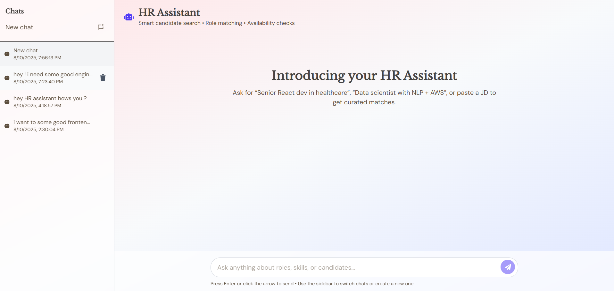

# HR Resource Query Chatbot
## Overview

The HR Resource Query Chatbot is an AI-powered assistant that helps HR teams quickly identify the most relevant employees for specific requirements. It uses a Retrieval-Augmented Generation (RAG) pipeline to fetch matching employee profiles from a vector database and generates professional, conversational suggestions for hiring managers.

- **Backend:** Built with **FastAPI**, **FAISS**, and **SentenceTransformers**
- **Conversational Layer:** Powered by **Gemini AI**
- **Frontend:** Developed in **React** with a modern chat interface

## Features

- Natural language candidate search (e.g., “Find AWS DevOps engineers with 5+ years of experience”)
- Retrieval-Augmented Generation (RAG) pipeline combining FAISS vector search and AI-generated responses
- FAISS vector store for fast, relevant employee search
- Gemini AI integration for professional HR recommendations
- Fallback response logic for graceful output if AI generation fails
- Match scoring with similarity scores for candidates
- Employee search API: filter by skill, experience, project keyword, and availability
- React frontend chat UI with employee cards
- CORS-enabled backend for seamless frontend-backend integration
- Centralized logging and error handling

## Architecture

The chatbot uses a RAG pipeline, combining vector search with an AI language model for human-like responses.

1. **Data Layer**
    - Employee profiles stored as JSON (`data/employees.json`)
    - Embeddings generated with `all-MiniLM-L6-v2` (SentenceTransformers)
    - FAISS vector store for fast similarity search
    - ID mapping links FAISS index entries to employee profiles

2. **Retrieval Layer**
    - User queries converted to embeddings
    - FAISS performs top-k nearest neighbor search using cosine similarity

3. **Augmentation Layer**
    - Retrieved profiles merged into a context string with the original query
    - Context includes name, experience, skills, projects, and availability

4. **Generation Layer**
    - Context passed to a Large Language Model (LLM) — Gemini/Gemma
    - LLM generates HR-assistant-style response, with fallback templates if needed

5. **API Layer (FastAPI)**
    - `/chat`: Accepts query, retrieves candidates, augments context, calls LLM, returns response

6. **Frontend Layer (React)**
    - Chat UI for queries and results
    - Candidate cards with details
    - Real-time integration with backend via REST API

## System Flow Diagram

User Query → Embedding Model → FAISS (Cosine Similarity Search) → Top-k Candidates → Augment with Context → LLM (Gemini/Gemma) → HR-Style Response → Frontend UI

## Setup & Installation

Follow the steps below to run the project locally.

### 1️⃣ Clone the Repository
```bash
git clone https://github.com/saifriaz001/HR-CHAT_BOT.git
cd HR-CHATBOT
```

### 2️⃣ Install Backend Dependencies
```bash
pip install -r requirements.txt
```

### 3️⃣ Configure Environment Variables
Create a `.env` file in the project root and add your API key:
```
GEMINI_API_KEY=your_api_key_here
```

### 4️⃣ Generate Embeddings
Navigate to the RAG engine folder and run the embedding generator script:
```bash
cd rag_engine
python embedding_generator.py
```

### 5️⃣ Start the Backend Server
From the root directory, run:
```bash
uvicorn backend.main:app --reload
```
The backend will start on http://localhost:8000

### 6️⃣ Install Frontend Dependencies
Navigate to the frontend directory:
```bash
cd frontend-hr
npm install
```

### 7️⃣ Configure Frontend API URL
In the `frontend-hr/.env` file, set the backend URL:
```
VITE_API_URL=http://localhost:8000
```
If the backend URL changes, update it here.

### 8️⃣ Start the Frontend
```bash
npm run dev
```
The frontend will start on http://localhost:5173

## API Documentation

### POST `/chat`

Retrieves relevant employee profiles for a given query and returns an HR-assistant-style response.

---

**Request Body:**
```json
{
  "query": "Looking for an AWS expert with DevOps experience",
  "top_k": 3
}
```

**Response Fields:**

| Field    | Type    | Description                                                         |
|----------|---------|---------------------------------------------------------------------|
| response | string  | AI-generated HR-assistant-style response including candidate matches |

Error Responses:

400 Bad Request — Missing or invalid query parameter.

500 Internal Server Error — Failure in embedding, retrieval, or LLM generation.


## AI Development Process

This project was developed with significant assistance from **ChatGPT (GPT-5)** as the primary AI coding assistant.

### AI Tools Used
- **ChatGPT** — Used for code generation, debugging, and architecture planning.

### How AI Helped in Different Phases
1. **Architecture & Design Decisions**  
   - Suggested the **RAG (Retrieval-Augmented Generation)** architecture.
   - Recommended using **FAISS** for vector similarity search and **SentenceTransformers** for embeddings.
   - Helped design prompt structures for HR-assistant-style responses.

2. **Code Generation**  
   - Generated initial FastAPI backend structure.
   - Implemented FAISS retrieval, context augmentation, and Gemini API integration.
   - Provided React frontend components for the chat UI and employee card layout.

3. **Debugging & Error Handling**  
   - Resolved CORS issues between React and FastAPI.
   - Fixed Gemini API model naming errors.
   - Suggested handling of quota/rate limit errors with fallback responses.

4. **Optimization & Best Practices**  
   - Recommended cosine similarity ranking for better candidate matching.
   - Suggested reusable singleton pattern for model loading to reduce memory usage.

### AI vs Hand-Written Code Ratio
- **AI-Assisted Code:** ~75% (generated with modifications and refinements).
- **Hand-Written Code:** ~25% (custom logic, debugging, integration fixes, and styling).

### Interesting AI-Generated Solutions
- A clean and modular **3-step pipeline** (Retrieval → Augmentation → Generation) that made the system maintainable.
- Professional HR-style response prompts for better candidate presentation.

### Challenges Solved Manually
- Configuring environment variables for Gemini API and React-FastAPI integration.
- Handling free-tier quota limits by switching models and updating `.env`.
- Styling frontend UI for better UX beyond AI's basic code output.


## Technical Decisions

### Choice of AI Model
We selected **Google Gemini** over OpenAI and local LLMs for the following reasons:
- **Performance:** Gemini provided faster and more contextually relevant HR-style responses compared to local models.
- **Ease of Integration:** Native Python SDK made it straightforward to integrate with our FastAPI backend.
- **Quality of Output:** Gemini produced more natural, professional responses suitable for HR assistant tasks.

### Why Not Ollama (Local LLM)?
- **Speed Issues:** Local inference with Ollama was significantly slower, especially for large context inputs.
- **Hardware Limitations:** Running a high-quality model locally required more GPU resources than were available during development.
- **Development Agility:** Cloud API allowed us to quickly test and refine prompts without dealing with model hosting and optimization overhead.

### Cloud API Considerations
- **Performance:** Cloud-hosted Gemini models ensured low-latency responses for a smooth chat experience.
- **Cost:** We initially used the free tier for testing but remained mindful of quota and rate limit constraints.
- **Scalability:** Cloud deployment means we can scale user requests without depending on client-side hardware capabilities.

### Privacy & Data Handling
- **Data Minimization:** Only anonymized employee data and user queries are sent to the AI model.
- **Local Vector Search:** All candidate retrieval is done locally via **FAISS**, ensuring personal data remains in our environment.
- **No Sensitive Data to API:** The AI only receives summarized, relevant context for generation, not raw databases.


## Future Improvements

If given more time, we would enhance the HR Resource Query Chatbot with the following features:

1. **Advanced Filtering & Search**
   - Support for multi-criteria filtering (skills, availability, location, salary expectations).
   - Fuzzy matching for skills and job titles.

2. **Conversation Memory**
   - Maintain session-based chat history to allow follow-up questions without re-entering context.
   - Personalize responses based on prior interactions.

3. **Candidate Profiles with Rich Media**
   - Display profile pictures, portfolio links, and video introductions.
   - Embed interactive skill charts and experience timelines.

4. **Integration with ATS/HR Systems**
   - Direct integration with tools like Greenhouse, Lever, or Workday.
   - Ability to shortlist and export candidates to existing HR workflows.

5. **Multi-Model AI Routing**
   - Dynamically choose between Gemini, GPT, and local LLMs based on request complexity and quota usage.
   - Implement a fallback model for high-traffic scenarios.

6. **Real-Time Updates**
   - Live updates on candidate availability and new hires.
   - WebSocket integration for instant response streaming.

7. **Enhanced Prompt Engineering**
   - Fine-tuned prompts to produce even more context-aware and role-specific recommendations.
   - Use chain-of-thought style multi-step reasoning for complex queries.

8. **User Authentication & Role-Based Access**
   - Secure login for HR managers.
   - Different access levels for recruiters, hiring managers, and admins.


## Demo

🚧 **Live Demo:** Currently unavailable due to backend hosting limitations (Render free tier runs out of RAM during processing).  
We recommend running the project locally using the instructions in the [Setup & Installation](#setup--installation) section.

### Screenshots

#### Chat Interface



#### Candidate Search Results

